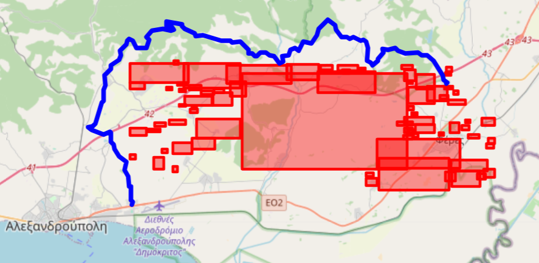

# Cassini_ResqMe
Mobile app in Flutter for showing evacuation route omitting dangerous areas.

This project focuses on utilizing Sentinel satellite imagery to detect and predict natural disasters such as floods or fires, segment affected areas, mark danger zones, and navigate safely around them.

1. Downloading Images from Sentinel Database
The first step in this project involves obtaining satellite imagery from the Sentinel database (e.g., Sentinel-2, Sentinel-3). These satellites provide open-access, high-resolution images that can be used to monitor various environmental conditions, including fires and floods.

2. Detecting Floods or Fires
Once the Sentinel images are downloaded, the next step is to detect potential disasters like floods or fires in the images. This can be done using machine learning models and image processing techniques.

Fire Detection:
Utilize the Sentinel-3 SLSTR L1B TIR  to detect fires in vegetation areas.
Flood Detection:
Use the Sentinel-3 OLCI L2 Water to detect changes in water levels, identifying flooded areas.

3. Predicting and Interpolating Next Images
Prediction and interpolation help anticipate how a disaster might evolve. This can be done using time-series analysis and machine learning models like LSTM or convolutional neural networks (CNN) trained on historical image data and weather forecast.

Prediction: Use temporal data to predict the spread of fires or flood zones.
Interpolation: Generate intermediate images to fill gaps in time or provide smooth transitions between time steps.

4. Segmentation of Affected Areas
Once a disaster has been detected, segmentation is used to isolate the affected areas. This step involves applying segmentation models to create masks that highlight the regions impacted by the flood or fire.

5. Marking Danger Zones
Once segmentation is completed, the next step is to mark the identified danger zones. These zones are critical for risk assessment, evacuation planning, and resource deployment.

6. Navigating with Skipping Danger Zones
Once the danger zones are identified and marked, the system can suggest a safe navigation route that avoids these zones.

|                          |                         |
:-------------------------:|:-------------------------:
  |   


# ResQMe Application

## Overview
**ResQMe** is an advanced emergency navigation app designed to provide users with safe evacuation routes during emergencies by leveraging real-time geolocation, danger zone avoidance algorithms, and multiple API integrations.

## Key Features
- **Real-Time Navigation**: Dynamic routes to evacuate users from danger zones.
- **Danger Zone Avoidance**: Custom algorithms to bypass unsafe areas.
- **Help Feature**: Emergency location sharing with contacts.
- **Interactive Search**: Destination search using Google Places API.

## UI Key Features
- **Google Maps Integration**: Displays user's location and planned routes.
- **Location Tracking**: Updates the user's position continuously.
- **Proximity Alerts**: Notifies users of nearby danger zones.
- **Local Notifications**: Alerts for nearby hazards and updates.
- **Route Visualization**: Marks evacuation routes with start and end markers.
- **Danger Zone Markers**: Displays danger zones clearly on the map.

## Functional Requirements
- **Fetch and Display Danger Zones**: Loads and displays danger zones from a JSON file as polygons on the map.
- **Dynamic Route Simulation**: Allows destination selection via search or map interaction, calculates routes, and displays them.
- **Travel Mode Selection**: Offers walking or driving options, influencing route calculations.

## Happy Path UI Scenario
1. **Welcome Screen**: Requests location and notification permissions.
2. **Danger Detection Notification**: Alerts if near a danger zone.
3. **Home Screen**: Shows map, current location, danger zones, and destination options.
4. **Select Destination**: Destination selection via search or map interaction.
5. **Choose Travel Mode**: Modal dialog to choose between driving and walking.
6. **Calculate and Display Route**: Computes and displays the safest route avoiding danger zones.

## Frontend System Specifications
- **Framework**: Flutter & Dart
- **Development Tools**:
    - Android Studio 2024.2
    - VS Code 1.95.3
    - Flutter 3.24.5
    - Dart 3.5.4
    - Java Version: OpenJDK 11
    - Gradle Version: 7.5
- **Supported Devices**:
    - Android Emulator (API 34)
    - Windows Desktop
    - Browsers: Google Chrome, Microsoft Edge

## Backend System Specifications
Sever is hosted locally on the port 5000 (http://localhost:5000)
- **Framework**: Flask (Python)
- **Endpoints**:
    - Home: `/`
    - `/navigate` Returning the shortest safe path for evacuation and getting the target and current user location

## Installation and running
### Frontend
```bash
git clone [https://github.com/michalinajnk/Cassini_ResqMe.git]
flutter pub get
flutter run
```

### Backend
assuming that the repository has been cloned and is at the ./Cassini_ResqMe location
```bash
cd ./backend
pip install -r 'requirements.txt'
python path_server.py
```


cd Cassini_ResqMe/backend


